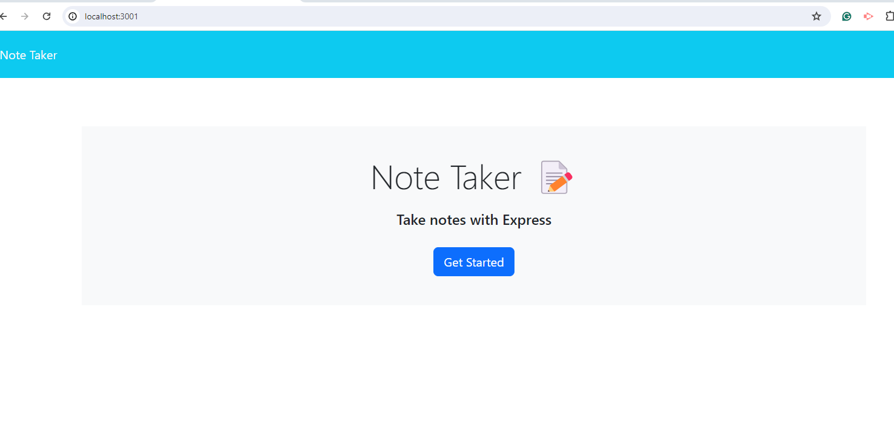
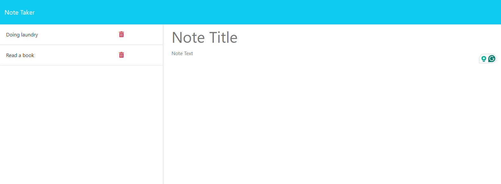
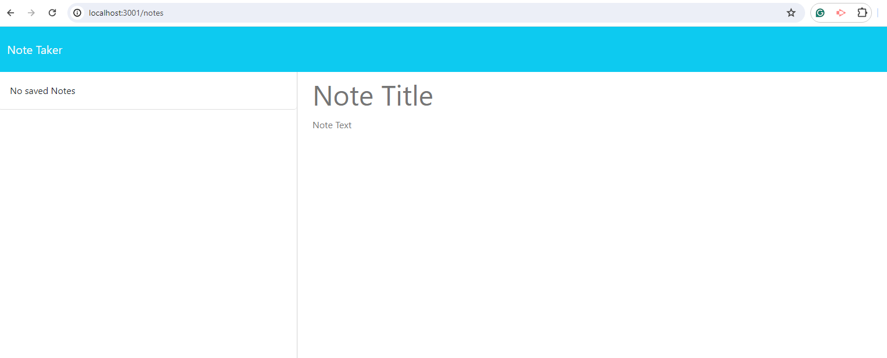

# Note-Taker-Express

# Description 
The purpose for this assignment was to create a note taking application using Node, Express.js and Render (as per instructor request) that will allow the user 
to write, save and delete notes. 

# Results 

# Usage 
1. The user downloads content from the repository. 
2. User will click "Get started" in order to open the note taker application and proceed to enter their notes in the "title" and "text" area. 
3. "Click" on the save icon on the top right corner to save the note and "+" icon to add another note.
4. To delete, "Click" the trash icon.

The video walkthrough is here: https://app.screencastify.com/v3/watch/VknChQ2I8mlcjOmXeRgw
Repository link: https://github.com/yamilhp5/Note-Taker- 

# Credits 
All contributions are from this user, https://github.com/yamilhp5. Help from my tutor following material covered in our bootcamp. 

# License 
MIT License 

# Features 
Node.js, Express.js, Render 
